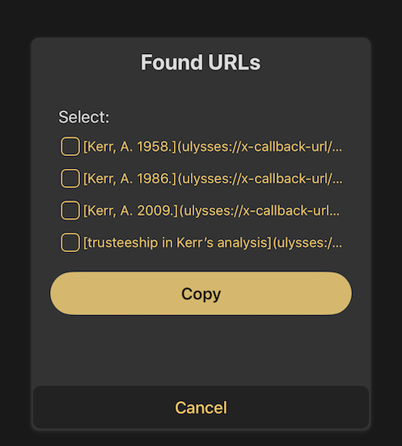

# Drafts-GetUlyssesSheetURL
Workflows and Drafts Action to search and copy URLs for Ulysses sheets

This is the iOS equivalent of [Alfred-GetUlyssesSheetURL](https://github.com/derickfay/Alfred-GetUlyssesSheetURL), but because there's no way to run an Alfred-style script filter in iOS, it instead:
1. requires the user to periodically run a Workflow workflow to update an index of Ulysses titles and URLs
2. uses a prompt within Drafts to select which links to copy

## Installation
1. Install [Update Ulysses URL Index](https://workflow.is/workflows/59cbeb1056ee490da6f356098168759d) in Workflow
2. Install [ProcessAllGroups for index](https://workflow.is/workflows/4ea1a8ee9cfa47c4b8d51ab07bdb95da) in Workflow.  You should never run this directly -- it's called by **Update Ulysses URL Index**
3. Install [Get Ulysses URL](https://actions.getdrafts.com/a/1Mj) in Drafts.  This includes the script in [getUlyssesSheetURLDraftsScript.js](getUlyssesSheetURLDraftsScript.js) - the file is posted here for reference only & will be installed automatically as part of the Drafts action.

## Usage

1. Run the **Update Ulysses URL Index** workflow.  This will create or refresh a file called **ulyssesIndex.txt** in your Dropbox.  You can ignore this file but don't delete it.  (If you want to change this location you will need to update both the **Update Ulysses URL Index** workflow and the script in the **Get Ulysses URL** Drafts action.)  This step needs to be repeated periodically to keep the index in sync with Ulysses itself.  (In the future, it might be better to make this a script that runs on a Mac based on a time interval in launchd or based on having Hazel look for changes to the Ulysses library....).
2. Run the **Get Ulysses URL** Drafts action
3. At the prompt, enter your search terms

4. Select results to be copied to the clipboard

## Acknowledgements

Like Alfred-GetUlyssesSheetURL, it owes a lot to [UlyssesReportAndMarkdown](https://github.com/rovest/UlyssesReportAndMarkdown).

